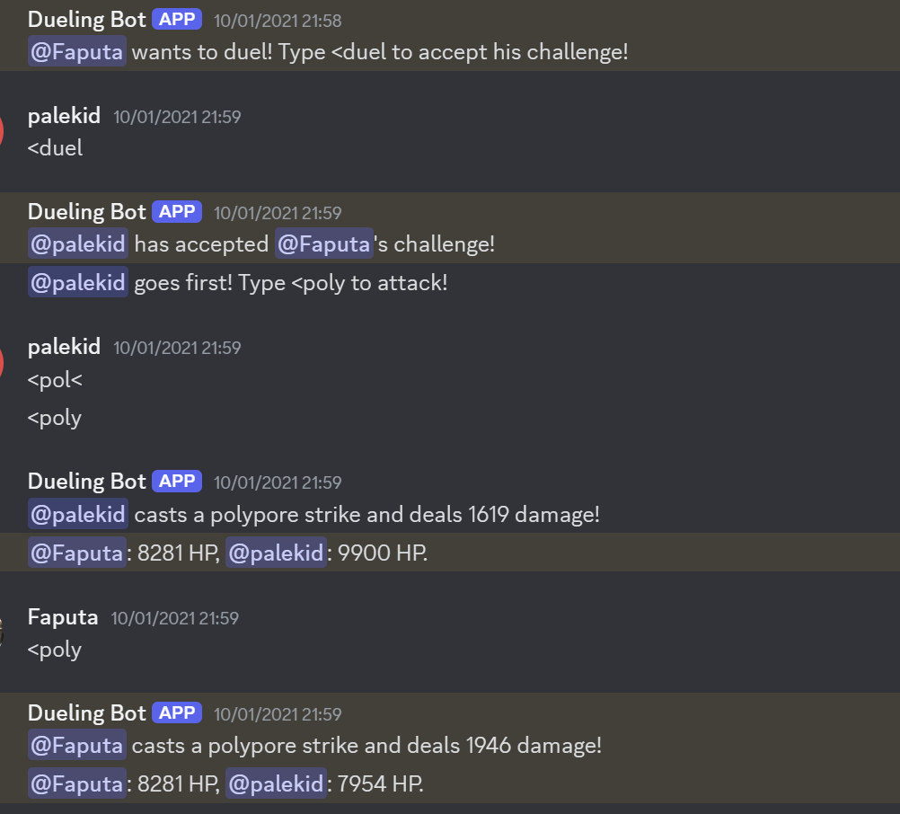

A Discord dueling bot that I made to brush up on the (now already outdated) modern JavaScript. 
It's based on the popular "Polypore dueling" from the game RuneScape.

Command list:
- "<help" - Display a help message.
- "<duel" - Offer or accept a duel.
- "<poly" - Use this to strike, when it's your turn

    

